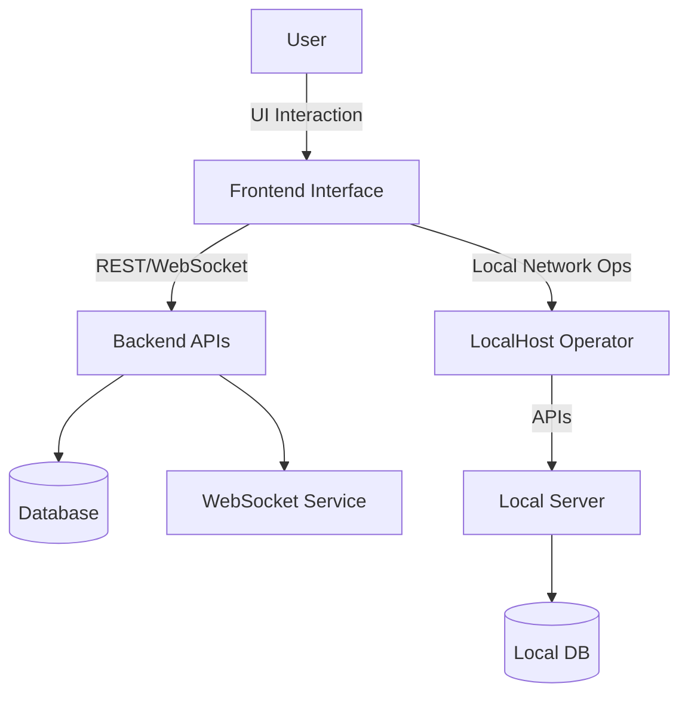

# RT-IDS

<div align="center">


A Real-Time Intrusion Detection System with a modular architecture for traffic monitoring, anomaly detection, and intuitive visualization.

</div>

## 🌐 Overview

**RT-IDS** is a modular and scalable system for real-time intrusion detection. It provides a comprehensive solution for traffic analysis, threat monitoring, and dashboard-based insights, with separate applications for backend APIs, data visualization, and local network management.

## 🌟 Features

* Real-time traffic monitoring and anomaly detection
* Dynamic visualization dashboard with responsive UI
* Modular backend with REST APIs and WebSocket streaming
* Support for data logging and migration
* Local network operator interface for device and traffic management
* Built with Python, Node.js, React, and Tailwind CSS

## 🧠 Architecture



## 📁 Project Structure

```
RT-IDS/
├── Backend/
│   ├── .env.example
│   ├── app.py                 # Entry point for Render server; applies filters on requests, blocks IPs, and stores in MongoDB Atlas
│   └── requirements.txt
│
├── Frontend/
│   ├── index.html
│   ├── package.json
│   ├── tailwind.config.js
│   ├── vite.config.js
│   └── src/
│       ├── App.jsx               # Entry point for frontend of the website where traffic goes and interacts
│       └── home-components/
│           ├── HomePage.jsx     # Contains GET and POST buttons to send requests to the Render server
│           └── Navbar.jsx
│
└── LocalHost Operator/          # Not meant for hosting, only for local monitoring and dashboards
    ├── client/
    │   ├── index.html
    │   ├── package.json
    │   └── src/
    │       ├── App.jsx
    │       ├── pages/
    │       │   ├── Overview.jsx          # Renders Chart1 and Chart2 from components
    │       │   └── BlockedIPTable.jsx    # Table showing all blocked IPs with reason and timestamp
    │       └── components/
    │           ├── Chart1.jsx            # Shows number of requests in the last 24 hours
    │           ├── Chart2.jsx            # Shows top 5 IPs in the last 1 hour, 1 day, and 10 days
    │           └── Navbar.jsx
    └── server/
        ├── .env.example
        ├── app.js
        ├── server.js             # Entry point – run with `nodemon server.js`
        ├── package.json
        ├── package-lock.json
        │
        ├── controllers/
        │   ├── logController.js          # controller to fetch all logs from mongodb compass
        │   ├── migrationController.js    # controller for migration of data from mongodb atlas to mongodb compass to free up cloud spaces
        │   └── requestLogsController.js  # controller to fetch all requestLogs from mongodb compass
        │
        ├── database/
        │   └── dbConnection.js      # connect to both atlas as when as local database compass
        │
        ├── middleware/
        │   └── error.js
        │
        ├── models/
        │   ├── BlockedIP.js
        │   ├── Log.js
        │   └── RequestLog.js
        │
        ├── routes/     # routes for all three controllers
        │   ├── log.js
        │   ├── migrate.js
        │   └── requestLog.js
        │
        └── services/
            └── websocket.js    # websocket to fetch atlas requestsLogs(1.2 minutes and older) store them in compass and free atlas space
```
# 🛠️ Tech Stack Used

## ⚙️ Backend (Render Hosted)
* **Flask** – Handles incoming requests, applies rate limiting and blocking logic
* **MongoDB Atlas** – Stores blocked IPs and request logs

## 🎨 Frontend (Render Hosted)
* **React** – UI library for building the main web interface
* **Tailwind CSS** – Utility-first CSS framework for styling
* **Vite** – Lightning-fast frontend build tool

## 🖥️ LocalHost Operator (Dashboard System - Not Deployed)
### 🧑‍💻 Client
* **React** – For dashboard UI
* **Tailwind CSS** – For styling components

### 🖧 Server
* **Node.js + Express.js** – REST API for dashboard
* **MongoDB** – Stores logs, blocked IPs, and request analytics
```

---

## 🛠️ Requirements

* Python 3.8+
* Node.js 16+
* MongoDB
* Git

## 📦 Installation

1. **Clone the repository**

   ```bash
   git clone https://github.com/yourusername/RT-IDS.git
   cd RT-IDS
   ```

2. **Backend Setup**

   ```bash
   cd Backend
   pip install -r requirements.txt
   cp .env.example .env
   # configure your environment variables
   ```

3. **Frontend Setup**

   ```bash
   cd ../Frontend
   npm install
   npm run dev
   ```

4. **LocalHost Operator Setup**

   ```bash
   cd ../LocalHost\ Operator/server
   npm install
   cp .env.example .env
   node server.js
   ```

   ```bash
   cd ../client
   npm install
   npm run dev
   ```

## 🚀 Usage

* Launch backend and both frontend apps
* Access dashboard from browser
* Use LocalHost Operator for local network insights

## 🔧 Customization

* Modify `tailwind.config.js` or `vite.config.js` for frontend customization
* Customize API logic in `controllers/` and `services/`
* Extend models in `models/` for new data types

## 🛡️ License

MIT License

---

<div align="center">
  <p>Crafted with ❤️ for real-time network protection</p>
</div>
