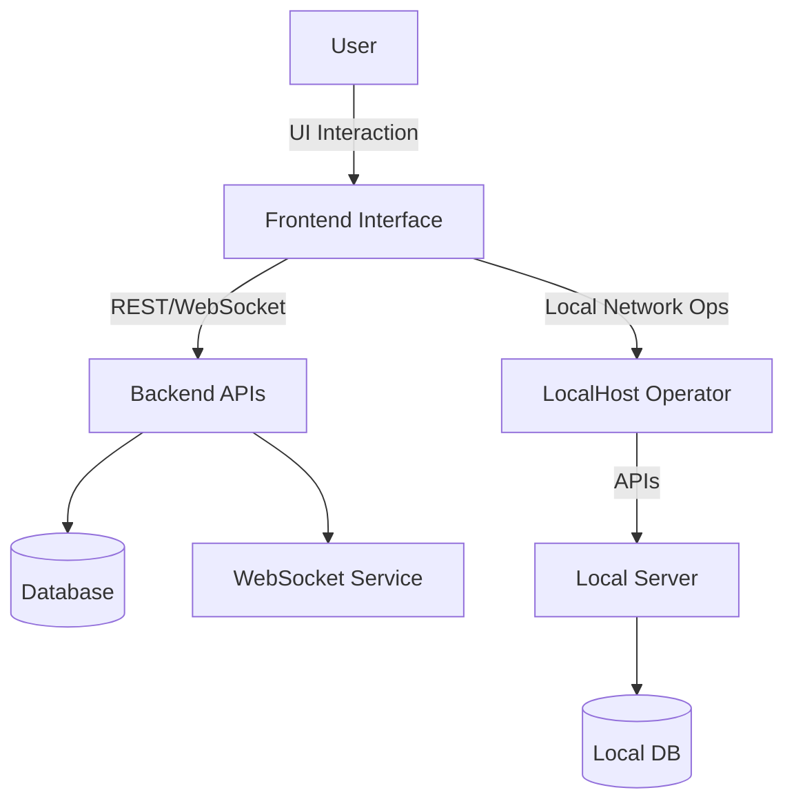

# RT-IDS

<div align="center">


A Real-Time Intrusion Detection System with a modular architecture for traffic monitoring, anomaly detection, and intuitive visualization.

</div>

## 🌐 Overview

**RT-IDS** is a modular and scalable system for real-time intrusion detection. It provides a comprehensive solution for traffic analysis, threat monitoring, and dashboard-based insights, with separate applications for backend APIs, data visualization, and local network management.

## 🌟 Features

* Real-time traffic monitoring and anomaly detection
* Dynamic visualization dashboard with responsive UI
* Modular backend with REST APIs and WebSocket streaming
* Support for data logging and migration
* Local network operator interface for device and traffic management
* Built with Python, Node.js, React, and Tailwind CSS

## 🧠 Architecture



## 📁 Project Structure

```
RT-IDS/
├── Backend/
│   ├── .env.example
│   ├── app.py             # entry point for render server, apply filter on requests and block IPs then store in mongodb atlas
│   └── requirements.txt
│
├── Frontend/
│   ├── index.html
│   ├── package.json
│   ├── tailwind.config.js
│   ├── vite.config.js
│   └── src/
│       ├── App.jsx
│       └── home-components/
│           ├── HomePage.jsx
│           └── Navbar.jsx
│
└── LocalHost Operator/
    ├── client/
    │   ├── index.html
    │   ├── package.json
    │   └── src/
    │       ├── App.jsx
    │       ├── pages/
    │       │   ├── Overview.jsx
    │       │   └── BlockedIPTable.jsx
    │       └── components/
    │           ├── Chart1.jsx
    │           ├── Chart2.jsx
    │           └── Navbar.jsx
    └── server/
        ├── app.js
        ├── server.js
        ├── controllers/
        ├── database/
        ├── middleware/
        ├── models/
        ├── routes/
        └── services/
```

## ⚙️ Backend

* `app.py`: Main FastAPI application for core backend
* RESTful APIs for logs, requests, and data migration
* Uses WebSocket for real-time communication

## 🎨 Frontend

* Built with React + Tailwind CSS
* Vite as the build tool
* Pages: Homepage, Navigation
* Animated and responsive design elements

## 🖥️ LocalHost Operator

### Client

* Custom React UI for local traffic and device management
* Charts, tables, and operational controls

### Server

* Node.js/Express backend
* MongoDB for data storage
* Modular architecture with controllers, routes, and services

## 🛠️ Requirements

* Python 3.8+
* Node.js 16+
* MongoDB
* Git

## 📦 Installation

1. **Clone the repository**

   ```bash
   git clone https://github.com/yourusername/RT-IDS.git
   cd RT-IDS
   ```

2. **Backend Setup**

   ```bash
   cd Backend
   pip install -r requirements.txt
   cp .env.example .env
   # configure your environment variables
   ```

3. **Frontend Setup**

   ```bash
   cd ../Frontend
   npm install
   npm run dev
   ```

4. **LocalHost Operator Setup**

   ```bash
   cd ../LocalHost\ Operator/server
   npm install
   cp .env.example .env
   node server.js
   ```

   ```bash
   cd ../client
   npm install
   npm run dev
   ```

## 🚀 Usage

* Launch backend and both frontend apps
* Access dashboard from browser
* Use LocalHost Operator for local network insights

## 🔧 Customization

* Modify `tailwind.config.js` or `vite.config.js` for frontend customization
* Customize API logic in `controllers/` and `services/`
* Extend models in `models/` for new data types

## 🛡️ License

MIT License

---

<div align="center">
  <p>Crafted with ❤️ for real-time network protection</p>
</div>
